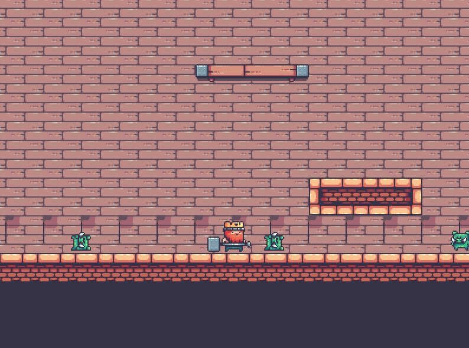
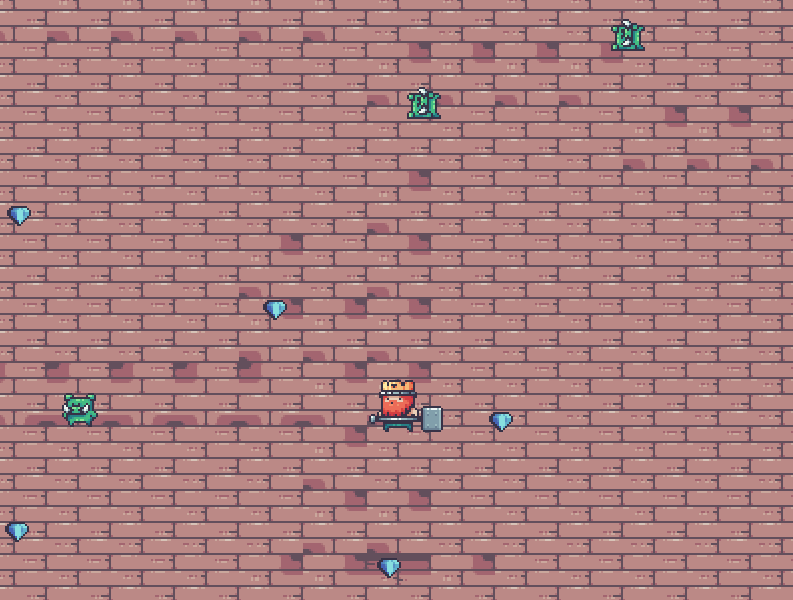

# Pig Adventure - First Phaser Game

**Phaser 3 + Webpack**

This repository is my first try to use **Phaser 3**  to make a game.

The game has two scenes, side-scrolling and full screen. The character control method is different.

**Live demo:** [https://mighty-woodland-44601-55e1d20ca608.herokuapp.com/](https://mighty-woodland-44601-55e1d20ca608.herokuapp.com/)

**Side-scrolling**

**Full Screen**

## Tools used

- Aseprite - Sprite / Animation creation
- Tiled - Map / Tileset creation

## Game Features

- Multiple Scenes - side-scrolling / full screen
- Character Animation and Control - Up, Down, Left, Right, Jump, Attack
- Sprite animation and state management - Idel, Run, Dead, Attack, Jump
- Physical Interaction - Collision
- Simple Enemy Behavior - chase Character
- BGM

## Build with

- Phaser - Game Framework
- Webpack - Asset Bundling
- node.js - JS runtime

## Future Development

- Responsive Design
- UI Components - Scoreboard, Health
- Backend to store score and user
- BGM control
- More Character / Enemy Behaviors
- Sound Effects - attack, dead, hit, etc.

## Acknowledgments

**Kings and Pigs** - assets provider

[https://pixelfrog-assets.itch.io/kings-and-pigs](https://pixelfrog-assets.itch.io/kings-and-pigs)